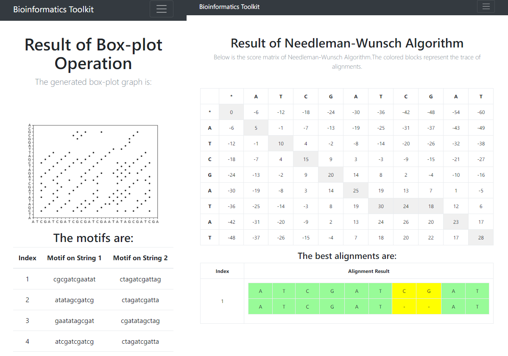

# Bioformatics Toolkit

A toolkit for Bioformatics, containing:
  1. K Operation (on string)
  1. FASTA Alignment
  1. Box Plot Graph
  1. Needleman-Wunsch Algorithm (for alignment)
  1. Smith-Waterman Algorithm (for alignment)
  1. Sensing Matrix (for finding functional locus)
  1. CpG Islands
  1. Draw Phylogenetic Tree
  
## Installation
python3-tk is required...

```sh
sudo apt install python3-tk
```

## Screenshot

